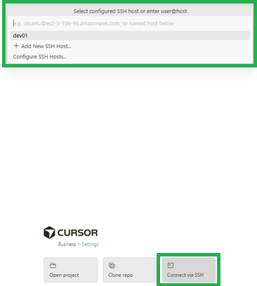

# Developer Onboarding

This guide helps new developers get access, set up tools, and onboard to AI Fabrix or Workato.

**⚠️ Important: You need eSystems Twingate activated before you can use any services!**

**Platform-specific guides:**

- [Windows](#windows-developer-onboarding) - Choose from RDP-only, SSH-only, or SSH+RDP
- [macOS](#macos-developer-onboarding) - RDP only (recommended for Mac users)

## 1) Get access

- Request a developer account via Service Desk:  
  `https://esystem.atlassian.net/servicedesk/customer/portal/2/group/6/create/17`
  - Choose "Dev – Workato" or "Dev – AI Fabrix" as appropriate.

---

## Windows Developer Onboarding

**Note**: When using RDP, you do not need to install Cursor on your local Windows machine. Cursor is pre-installed in the RDP session and available after connecting.

### 2) Choose your onboarding method

Windows developers have three options for onboarding:

1. **[RDP Only](#rdp-only-onboarding-windows)** - Simplest option, PIN + password only
2. **[SSH Only](#ssh-only-onboarding-windows)** - Lightweight, terminal-only access
3. **[SSH + RDP](#ssh--rdp-full-onboarding-windows)** - Full setup with both SSH and RDP access

---

### RDP Only Onboarding (Windows)

**Best for**: Users who only need RDP access. Simplest and fastest onboarding method.

**What you need:**

- Developer ID and PIN (provided by admin)
- No additional software required

**Step 1: Download the script**

```powershell
New-Item -ItemType Directory -Force -Path "C:\Setup" | Out-Null
Invoke-WebRequest -Uri "https://raw.githubusercontent.com/esystemsdev/configuration/main/OnboardDeveloper.ps1" -OutFile "C:\Setup\OnboardDeveloper.ps1"
```

**Step 2: Run the onboarding script (RDP-only mode)**

```powershell
powershell -ExecutionPolicy Bypass -File "C:\Setup\OnboardDeveloper.ps1" -Server dev.aifabrix -DeveloperId <DeveloperId> -RDPOnly -Pin <YourPIN>
```

Replace `<DeveloperId>` with your actual developer ID (e.g., `01`, `02`, etc.) and `<YourPIN>` with your PIN code.

**What happens:**

- Script prompts you to set a password for RDP authentication (with confirmation)
- Sets your RDP password using the PIN code
- No SSH keys are generated
- No GitHub setup required
- Ready to connect via RDP immediately

**Step 3: Connect via RDP**

Once onboarding is complete, wait a few minutes for the Docker container to start up, then:

- Open Remote Desktop Connection
- Enter server address: `dev.aifabrix:<port>` where port = `3389 + (DeveloperId * 100)`
  - Example: `dev01` uses port `3489` (3389 + 100)
  - Example: `dev02` uses port `3589` (3389 + 200)
  - Example: `dev03` uses port `3689` (3389 + 300)
- Log in with username `dev<DeveloperId>` (e.g., `dev01`) and the password you set during onboarding

See [RDP Connection Guide](#4-rdp-connection-guide) for detailed instructions.

---

### SSH Only Onboarding (Windows)

**Best for**: Lightweight development tasks, terminal-only access, Workato SDK development.

**What you need:**

- Developer ID and PIN (provided by admin)
- Cursor editor: `https://cursor.com/download` (required for SSH via Cursor)
- For AI Fabrix developers (optional here, required for local infra):
  - Node.js 18+
  - Docker Desktop

**Step 1: Download the script**

```powershell
New-Item -ItemType Directory -Force -Path "C:\Setup" | Out-Null
Invoke-WebRequest -Uri "https://raw.githubusercontent.com/esystemsdev/configuration/main/OnboardDeveloper.ps1" -OutFile "C:\Setup\OnboardDeveloper.ps1"
```

**Step 2: Run the onboarding script**

```powershell
powershell -ExecutionPolicy Bypass -File "C:\Setup\OnboardDeveloper.ps1" -Server dev.aifabrix -DeveloperId <DeveloperId>
```

Replace `<DeveloperId>` with your actual developer ID (e.g., `01`, `02`, etc.).

**What happens:**

- Script generates SSH keys (ed25519) if they don't exist
- Prompts you to set a password for RDP authentication (required even for SSH-only)
- Registers your SSH public key
- Optionally sets up GitHub SSH key (if you provide a GitHub token)
- Creates SSH config entry for easy access

**Step 3: Connect via SSH**

Once onboarding is complete, wait a few minutes for the Docker container to start up, then:

1. **Connect via SSH**: Click "Connect via SSH" in Cursor's welcome screen
2. **Select your SSH user**: Choose your configured SSH host (e.g., `dev01.aifabrix`) or enter `user@host` format
3. **Automatic connection**: Cursor will automatically connect you to your developer container
   - **Note**: SSH connects directly to your Docker container. The container needs time to start up after onboarding. If the connection fails, wait a few minutes and try again.

See [SSH Connection Guide](#5-ssh-connection-guide-windows-only) for detailed instructions.

---

### SSH + RDP Full Onboarding (Windows)

**Best for**: Full development power with both SSH and RDP access. Recommended for most developers.

**What you need:**

- Developer ID and PIN (provided by admin)
- Cursor editor: `https://cursor.com/download` (for SSH via Cursor)
- For AI Fabrix developers (optional here, required for local infra):
  - Node.js 18+
  - Docker Desktop

**Step 1: Download the script**

```powershell
New-Item -ItemType Directory -Force -Path "C:\Setup" | Out-Null
Invoke-WebRequest -Uri "https://raw.githubusercontent.com/esystemsdev/configuration/main/OnboardDeveloper.ps1" -OutFile "C:\Setup\OnboardDeveloper.ps1"
```

**Step 2: Run the onboarding script**

```powershell
powershell -ExecutionPolicy Bypass -File "C:\Setup\OnboardDeveloper.ps1" -Server dev.aifabrix -DeveloperId <DeveloperId>
```

Replace `<DeveloperId>` with your actual developer ID (e.g., `01`, `02`, etc.).

**Step 3: Register GitHub token (optional)**

1. Create a GitHub Personal Access Token (if you don't have one)
2. When prompted by the script, paste your GitHub token
3. The script will automatically set up GitHub SSH key for server-side commits

**What happens:**

- Script generates SSH keys (ed25519) if they don't exist
- Prompts you to set a password for RDP authentication (with confirmation)
- Registers your SSH public key
- Sets up GitHub SSH key (if token provided)
- Creates SSH config entry for easy access
- You can now use both SSH and RDP

**Step 4: Connect after onboarding**

Once onboarding is complete, wait a few minutes for the Docker container to start up. You can use either connection method:

**Option 1: RDP (Recommended - Full Development Power)**

- Open Remote Desktop Connection
- Enter server address: `dev.aifabrix:<port>` where port = `3389 + (DeveloperId * 100)`
- Log in with username `dev<DeveloperId>` and your password

See [RDP Connection Guide](#4-rdp-connection-guide) for detailed instructions.

**Option 2: SSH (Lightweight - Terminal Only)**

```powershell
ssh dev<DeveloperId>.aifabrix
```

See [SSH Connection Guide](#5-ssh-connection-guide-windows-only) for detailed instructions.

---

## macOS Developer Onboarding

**Important**: macOS developers can only use RDP connection. SSH via Cursor is not supported on Mac.

**Note**: When using RDP, you do not need to install Cursor on your local Mac. Cursor is pre-installed in the RDP session and available after connecting.

### 2) RDP Only Onboarding (macOS)

**Best for**: macOS users (RDP is the only supported connection method).

**What you need:**
- Developer ID and PIN (provided by admin)
- Microsoft Remote Desktop: Install from [Mac App Store](https://apps.apple.com/app/microsoft-remote-desktop/id1295203466)

**Step 1: Install Microsoft Remote Desktop**

Install from [Mac App Store](https://apps.apple.com/app/microsoft-remote-desktop/id1295203466)

**Step 2: Onboarding (macOS)**

You need to run the onboarding script once to create your developer account and Docker container. You have two options:

#### Option A: Use PowerShell Core with RDP-only mode (Recommended)

1. **Install PowerShell Core**:

   ```bash
   brew install --cask powershell
   ```

2. **Download and run the onboarding script (RDP-only mode)**:

   ```bash
   mkdir -p ~/Setup
   curl -o ~/Setup/OnboardDeveloper.ps1 https://raw.githubusercontent.com/esystemsdev/configuration/main/OnboardDeveloper.ps1
   pwsh ~/Setup/OnboardDeveloper.ps1 -Server dev.aifabrix -DeveloperId <DeveloperId> -RDPOnly -Pin <YourPIN>
   ```

   Replace `<DeveloperId>` with your actual developer ID (e.g., `01`, `02`, etc.) and `<YourPIN>` with your PIN code.

   **What happens:**
   - Script prompts you to set a password for RDP authentication (with confirmation)
   - Sets your RDP password using the PIN code
   - No SSH keys are generated
   - No GitHub setup required
   - Ready to connect via RDP immediately

#### Option B: Manual onboarding with curl (RDP-only)

If you prefer not to use PowerShell, you can manually call the password API:

```bash
curl -X POST http://dev.aifabrix:9999/api/set-password \
  -H "Content-Type: application/json" \
  -d '{
    "developerId": "<DeveloperId>",
    "pin": "<YourPIN>",
    "password": "<YourPassword>"
  }'
```

Replace `<DeveloperId>`, `<YourPIN>`, and `<YourPassword>` with your actual values. The password must be at least 8 characters and contain uppercase, lowercase, and number.

**Step 3: Connect via RDP (macOS)**

**Note**: RDP is the only supported connection method for macOS developers.

See [RDP Connection Guide](#4-rdp-connection-guide) for detailed instructions.

**Quick start:**

1. **Open Microsoft Remote Desktop** (installed in Step 2)
2. **Add a new PC**:
   - Click "Add PC" or the "+" button
   - Enter PC name: `dev.aifabrix:3389`
   - Click "Add"
3. **Connect**:
   - Double-click the new connection
   - Log in with username `dev<DeveloperId>` (e.g., `dev01`) and the password you set during onboarding
   - You'll see the Xfce desktop environment

**Note**: The onboarding script sets your RDP password. After onboarding, you only need Microsoft Remote Desktop to connect - no other software is required on your Mac.

---

## 4) RDP Connection Guide

**Applies to**: Windows and macOS developers using RDP.

### Connecting to RDP

Each developer has a unique RDP port calculated as: **3389 + (DeveloperId × 100)**

**Port Examples:**

- `dev01` → Port `3489` (3389 + 100)
- `dev02` → Port `3589` (3389 + 200)
- `dev03` → Port `3689` (3389 + 300)
- `dev10` → Port `4389` (3389 + 1000)

**Windows:**

- Open Remote Desktop Connection
- Enter server address: `dev.aifabrix:<your-port>` (use your calculated port from above)
- Log in with username `dev<DeveloperId>` (e.g., `dev01`) and the password you set during onboarding

**macOS:**

- Open Microsoft Remote Desktop
- Add new PC: `dev.aifabrix:<your-port>` (use your calculated port from above)
- Log in with username `dev<DeveloperId>` and the password you set during onboarding

### Using Development Tools

Once connected via RDP, you'll see the Xfce desktop environment:

1. **Bottom menu bar (dock)**: Access basic tools from the bottom menu bar:

   - **Terminal** - Command line interface
   - **Web browser** - For testing web applications

2. **Top menu - Applications > Development**: Access development tools from the top menu:

   - **Cursor** - Code editor (pre-installed)
   - **Postman** - API testing tool (pre-installed)

3. **Understanding your environment:**
   - **RDP session**: Runs on the host OS (Linux server)
   - **Terminal**: When you open a terminal, you're automatically dropped into your Docker container
   - **Files**: `/home/dev01` on host = `/workspace` in container (same files, automatically synced)

4. **Launch Cursor**:
   - Go to **Applications > Development > Cursor** from the top menu
   - Open workspace: `/workspace`
   - Go to the **Extensions** tab - you'll automatically be asked to install recommended extensions
   - **GitHub login**: It's easier to use Cursor's HTTP GitHub login, or you can use terminal for Git operations
   - All development tools are available via terminal in Cursor

5. **Using development tools:**
   - When you open a terminal in Cursor, you're already in your container
   - All tools are pre-installed: `node`, `pnpm`, `aifabrix`, `git`, etc.
   - No need to run `docker exec` - you're already there!

### First-time setup

When installing for the first time as a developer:

1. **Open Cursor** and open workspace: `/workspace`
2. **Install extensions**: Go to the **Extensions** tab - you'll automatically be asked to install recommended extensions
3. **Clone repositories**: See [Git configuration](#6-git-configuration) section below for repository cloning instructions
4. **Start coding**: Once repositories are cloned, you're ready to start coding!

---

## 5) SSH Connection Guide (Windows Only)

**Applies to**: Windows developers only. macOS developers should use RDP.

### SSH + Cursor (Lightweight - Terminal Only)

**Best for**: Lightweight development tasks such as Workato SDK development or quick terminal operations.

**Install tools for SSH (Windows):**

- Cursor editor: `https://cursor.com/download` (required for SSH via Cursor)
- For AI Fabrix developers (optional here, required for local infra):
  - Node.js 18+
  - Docker Desktop



1. **Connect via SSH**: Click "Connect via SSH" in Cursor's welcome screen.
2. **Select your SSH user**: Choose your configured SSH host (e.g., `dev01.aifabrix`) or enter `user@host` format.
3. **Automatic connection**: Cursor will automatically connect you to your developer container.
   - **Note**: SSH connects directly to your Docker container. The container needs time to start up after onboarding. If the connection fails, wait a few minutes and try again.
4. **Clone repo or open existing folder**: Once connected, you can:
   - Clone a repository from your remote host
   - Open an existing folder on the remote host: select your working folder `/workspace/<your repo>`

### SSH: First-time setup

When installing for the first time as a developer:

- Open `/workspace/` root folder
- Clone repositories: See [Git configuration](#6-git-configuration) section below for repository cloning instructions

---

## 6) Git configuration

Configure your Git identity:

```bash
git config --global user.name "Your Name"
git config --global user.email "you@esystems.fi"
```

### Clone repositories

When installing for the first time as a developer, clone the following repositories:

```bash
git clone git@github.com:esystemsdev/aifabrix-miso.git
git clone git@github.com:esystemsdev/aifabrix-miso-azure.git
git clone git@github.com:esystemsdev/aifabrix-miso-backend.git
git clone git@github.com:esystemsdev/aifabrix-miso-client.git
git clone git@github.com:esystemsdev/aifabrix-miso-client-python.git
git clone git@github.com:esystemsdev/aifabrix-dataplane.git
git clone git@github.com:esystemsdev/aifabrix-d360.git
git clone git@github.com:esystemsdev/aifabrix-core.git
git clone git@github.com:esystemsdev/aifabrix-form-engine.git
git clone git@github.com:esystemsdev/aifabrix-builder.git
git clone git@github.com:esystemsdev/aifabrix-docs.git
git clone git@github.com:esystemsdev/openwebui-template.git
git clone git@github.com:esystemsdev/flowise-template.git
```

## 7) AI Fabrix developer basics

### Step 1: Install Builder CLI

```bash
npm install -g @aifabrix/builder
```

### Step 2: Quick start (minimal)

1. **Put infra up:**

```bash
aifabrix up
```

1. **Open miso-controller project:**

Navigate to the miso-controller project directory.

1. **Build Keycloak Docker image:**

```bash
aifabrix build keycloak
```

1. **Run Keycloak locally:**

```bash
aifabrix run keycloak
```

1. **Build Docker image:**

```bash
aifabrix build miso-controller
```

1. **Run in local Docker:**

```bash
aifabrix run miso-controller
```

1. **Validate via web-browser:**

Open your web browser and verify the services are running.

**Happy coding!**

See the Builder docs and CLI reference:  
`https://github.com/esystemsdev/aifabrix-builder`

## 8) AI Fabrix Developer Workspace

This is your workspace root inside the container: `/workspace`.

Key locations and settings:

- Per-developer config: `/home/dev{id}/.aifabrix/config.yaml`
- Default config values:

```yaml
environment: 'dev'
developer-id: '{id}'
secrets-encryption: '<key from Key Vault>'
aifabrix-home: '/workspace/.aifabrix'
aifabrix-secrets: '/workspace/aifabrix-miso/builder/secrets.local.yaml'
```

Notes:

- Use `aifabrix` CLI for local infrastructure and app workflows.
- Docker access is via `aifabrix-docker` inside this container.
- Editors available: `vim`, `nano`.

## 9) Workato developer basics

Follow the internal guide for org access, environments, and tooling:  
`https://esystem.atlassian.net/wiki/spaces/EWKT/pages/209879302147/Custom+Connector+SDK`

## 10) Security notes

- Do not paste or commit PINs or secrets. Prefer interactive prompts.
- PINs are single‑use and time‑limited. If a claim fails, request a new PIN.
- Never share private keys. Public keys only are used during onboarding.

## 11) Reference information

### Onboarding script details

**What the script does:**

**Full onboarding mode (default):**

- Automatically generates SSH keys (ed25519) if they don't exist
- Prompts you to set a password for RDP authentication
- Calls the onboarding service on `http://<server>:9999/api/claim` to register your public key and set your password using a temporary PIN
- Optionally sets up GitHub SSH key for server-side commits (requires a Personal Access Token)
- Adds an SSH config entry for quick access using `ssh dev<DeveloperId>.<domain>`
- Note: SSH connects directly to your Docker container, which needs time to start up. If the container is not running, SSH will not work.

**RDP-only mode (`-RDPOnly` flag):**

- Skips SSH key generation and validation
- Skips GitHub token collection
- Only collects PIN and password (with validation)
- Calls the onboarding service on `http://<server>:9999/api/set-password` to set your RDP password
- Does not add SSH config entries
- Perfect for users who only need RDP access (simplest onboarding method)
- Also useful for changing your password after initial onboarding without going through the full setup process

**Script parameters:**

| Parameter | Type | Required | Default | Description |
| --- | --- | --- | --- | --- |
| `-Server` | string | No | `"dev.aifabrix"` | The development server hostname |
| `-DeveloperId` | string | Yes* | - | Your developer ID (1-6 digits). Will be prompted if not provided |
| `-Pin` | string | Yes* | - | Your PIN (4-8 digits). Will be prompted if not provided |
| `-GitHubToken` | string | No | - | GitHub Personal Access Token for server-side SSH key setup. Will be prompted if not provided |
| `-RDPOnly` | switch | No | - | RDP-only mode: Sets/changes RDP password without SSH key generation or GitHub setup. Requires `-Pin` parameter. |

*Required but can be provided interactively if not specified as parameters.

**Onboarding process:**

**Full onboarding (default):**

1. The script prompts for your Developer ID and PIN if not provided as parameters
2. Prompts you to set a password for RDP authentication (with confirmation)
3. Checks for existing SSH keys in `~/.ssh/` and generates new ed25519 keys if needed
4. Sends your public SSH key and password to the onboarding API endpoint (`/api/claim`) to claim access
5. Creates an SSH config entry for easy access using `ssh dev<DeveloperId>.<domain>`
6. Optionally, if a GitHub token is provided, the server will generate an SSH key and add it to your GitHub account

**RDP-only mode (`-RDPOnly` flag):**

1. The script prompts for your Developer ID and PIN if not provided as parameters
2. Prompts you to set a password for RDP authentication (with confirmation)
3. Sends PIN and password to the password API endpoint (`/api/set-password`) to set your RDP password
4. Shows simplified success message with RDP connection information
5. Note: PIN is marked as used after successful password change (single-use)

**Troubleshooting:**

- **Twingate connectivity**: Validate that your Twingate is up and running and can ping `dev.aifabrix`. If Twingate is not connected or cannot reach the server, SSH connections will fail.
- **Container startup**: SSH connects directly to your Docker container. The container needs time to start up. If the container is not running, SSH connections will fail. Wait a few minutes after onboarding and try again.
- **Connection fails immediately after onboarding**: Wait a few minutes for the Docker container to start up. The container needs time to initialize after onboarding.
- **Invalid Developer ID or PIN error**: Verify your Developer ID and PIN are correct. Ensure the PIN hasn't expired (request a new one if needed). Check that you're using the correct server address.
- **SSH connection refused**: Ensure the onboarding service is reachable from your network on port `9999`. Verify the server address is correct. Check that the container has finished starting up.
- **If the SSH test fails**, run once to trust the host key.
- **Password change failed**: If using `-RDPOnly` flag, ensure your PIN is valid and hasn't been used. PINs are single-use - if you've already used your PIN, request a new one from the admin.
